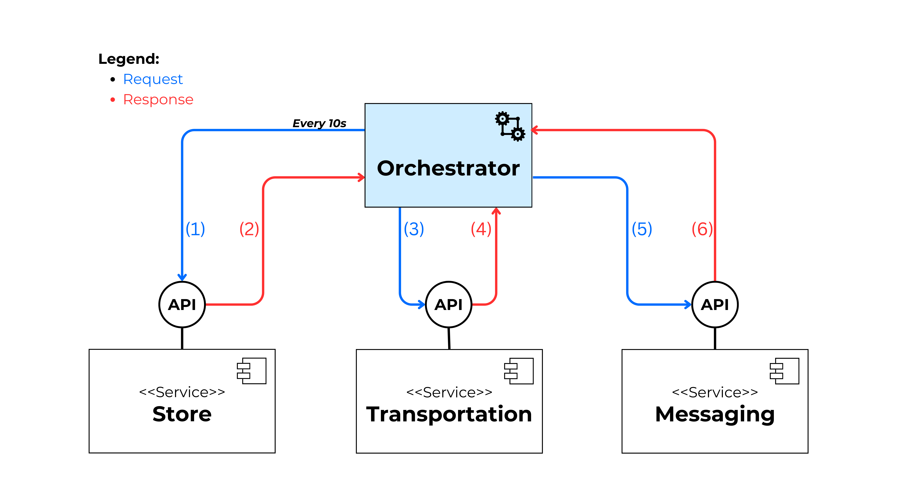

# Towards a Choreography-Based Approach for Service Integration in Smart Cities

## 0. Table of Contents

1. [About the Project](#1-about-the-project)
2. [Evaluated Scenario](#2-evaluated-scenario)
3. [Previous Approach](#3-previous-approach-orchestration)
4. [Developed Approach](#4-developed-approach-choreography)
5. [About the Repository](#5-about-the-repository)
6. [Repository Structure](#6-repository-structure)

## 1. About the Project

The project titled _"Towards a Choreography-Based Approach for Service Integration in the Context of Smart Cities"_ aims to analyze the use of choreography as an alternative for service integration in smart city environments. Initially, the integration of these services was approached through an orchestration framework, hence the work focuses on evaluating the benefits and challenges of a choreography-based solution.

The research included an analysis of available tools and projects, both active and historical, for implementing choreographies in service integration. From this analysis, the most suitable tools were selected based on their functionality, support, active community, and market adoption.

As part of the development, proof of concept tests were conducted using three selected tools to validate their integration capabilities. Finally, an objective comparison among the tools was made based on metrics, to substantiate the analysis beyond theory.

### Context Requirements

This work is motivated by the need to integrate multiple services in a smart city, enabling the execution of complex processes that require collaboration among various services. Additionally, the solution must meet quality requirements such as:

- **Security:** Ensure the protection of sensitive data during transport, processing, and storage.
- **Availability:** Ensure that services are operational and continuously accessible, given their intensive usage.
- **Scalability:** Allow infrastructure growth to manage peak demand.
- **Resilience:** Ensure rapid recovery of services in case of failures.

## 2. Case Study Scenario

The evaluated scenario considers the integration of three services: a store service, a transportation service, and a messaging service. These services, offered by independent entities, expose their functionalities through APIs. The services are: **Store**, **Transportation**, and **Messaging**.

The goal of the scenario is to provide a free transport ride to customers who make a purchase greater than 150,000 pesos. The process includes the following steps:

1. The customer makes a purchase at the store.
2. If the purchase amount exceeds 150,000 pesos, a ride is reserved using the transportation service.
3. The ride information is sent to the customer via the messaging service.

Since this process involves sensitive customer data, **data security** is a critical aspect, and solutions must be designed to ensure the protection of information at all stages.

## 3. Current Approach (Orchestration)

The scenario initially considers a solution based on orchestration, where a central orchestrator managed the entire process flow. This orchestrator followed the steps below:



1. **Polling:** The orchestrator periodically queries the store service to detect new sales.
2. **Validation:** If a sale is detected, it checks if the amount exceeds 150,000 pesos.
3. **Transport Reservation:** If the sale meets the criterion, a reservation is requested to the transportation server.
4. **Message Sending:** Once the ride is reserved, the information is sent to the customer using the messaging service.

## 4. Developed Approach (Choreography)

As an alternative, a choreography-based solution was designed, where each service operates autonomously and communicates through events and messages. This approach eliminates the need for a central controller, distributing logic among the services.

After an exhaustive analysis of tools, the three best solutions for this scenario were selected: **RabbitMQ**, **Kafka**, and **Pulsar**, all of which are capable of implementing messaging brokers that facilitate communication through events.

## 5. About the Repository

This repository contains:

- Implementations of proof of concept tests using the selected tools for service integration through choreography.
- Integration examples where services interact through distributed events.
- Diagrams and other visual resources that describe integration flows and interactions among services.
- Scripts and configurations used to evaluate the performance and feasibility of the selected tools.

## 6. Repository Structure

```
├── alternatives   // Folder with each tool implementations
├── api            // APIs that simulate the services of Store, Transportation, and Messaging
└── docs           // Folder with documents content
    └── assets     // Folder with diagrams and visual content
└── .gitignore     // Github ignore file
└── README.md      // You are here
```

Within each folder, you will find a README file with additional information about the research, implementations, and tests conducted.
