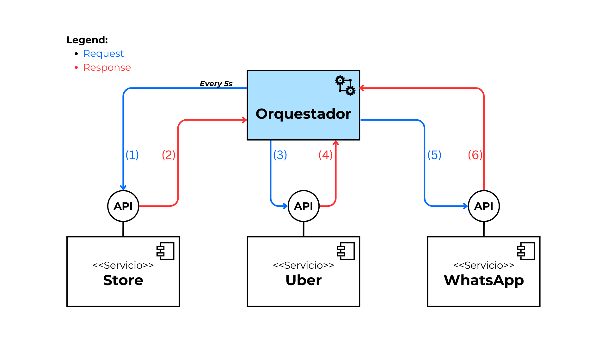

# Repositorio de la Tesis: Hacia una Aproximación Basada en Coreografía para la Integración de Servicios en Ciudades Inteligentes

## 0. Índice

1. [Acerca de la tesis](#1-acerca-de-la-tesis)
2. [Escenario evaluado](#2-escenario-evaluado)
3. [Aproximación previa](#3-aproximación-previa-orquestación)
4. [Aproximación desarrollada](#4-aproximación-desarrollada-coreografía)
5. [Acerca del repositorio](#5-acerca-del-repositorio)
6. [Estructura del repositorio](#6-estructura-del-repositorio)

## 1. Acerca de la tesis

La tesis titulada _"Hacia una aproximación basada en coreografía para la integración de servicios en el contexto de ciudades inteligentes"_ tiene como objetivo analizar el uso de la coreografía como un método para la integración de servicios en entornos de ciudades inteligentes. Inicialmente, la integración de estos servicios se abordaba mediante un enfoque de orquestación, por lo que el trabajo se enfoca en evaluar los beneficios y desafíos de una solución basada en coreografía.

La investigación abarcó un análisis de herramientas y proyectos disponibles, tanto activos como históricos, para la implementación de coreografías en la integración de servicios. A partir de este análisis, se seleccionaron las herramientas más adecuadas con respecto a su funcionalidad, soporte, comunidad activa y adopción en el mercado.

Como parte del desarrollo, se realizaron pruebas de concepto utilizando tres herramientas seleccionadas para validar su capacidad de integración. Finalmente, se realizó una comparación objetiva entre las herramientas a partir de métricas, a fin de fundamentar el análisis más allá de la teoría.

### Requisitos del contexto

Este trabajo está motivado por la necesidad de integrar múltiples servicios en una ciudad inteligente, permitiendo la ejecución de procesos complejos que requieren la colaboración de diversos servicios. Además, la solución debe cumplir con requisitos de calidad como:

- **Seguridad:** Garantizar la protección de los datos sensibles durante su transporte, procesamiento y almacenamiento.
- **Disponibilidad:** Asegurar que los servicios estén operativos y accesibles de forma continua, dado su uso intensivo.
- **Escalabilidad:** Permitir el crecimiento de la infraestructura para gestionar picos de demanda.
- **Resiliencia:** Asegurar la rápida recuperación de los servicios en caso de fallos.

## 2. Escenario evaluado

El escenario evaluado considera la integración de tres servicios: una tienda que registra ventas, un servicio de transporte y un servicio de mensajería. Estos servicios, ofrecidos por entidades independientes, exponen sus funcionalidades a través de APIs. Los servicios son: Store, Uber y WhatsApp.

El objetivo del escenario es proporcionar un viaje gratuito de Uber a los clientes que realicen una compra mayor a 150.000 pesos. El proceso incluye los siguientes pasos:

1. El cliente realiza una compra en la tienda.
2. Si el monto de la compra supera los 150,000 pesos, se reserva un viaje en Uber.
3. La información del viaje se envía al cliente mediante WhatsApp.

Dado que este proceso involucra datos sensibles de los clientes, la **seguridad de los datos** es un aspecto crítico, y se deben diseñar soluciones que aseguren la protección de la información en todas las fases.

## 3. Aproximación Previa (Orquestación)

El escenario inicialmente considera una solución basada en orquestación, donde un orquestador central gestionaba todo el flujo del proceso. Este orquestador seguía los siguientes pasos:



1. **Polling:** El orquestador consulta periódicamente el servicio de la tienda para detectar nuevas ventas.
2. **Validación:** Si se detecta una venta, se verifica si el monto supera los 150,000 pesos.
3. **Reserva en Uber:** Si la venta cumple con el criterio, se solicita una reserva en Uber.
4. **Notificación en WhatsApp:** Una vez reservado el viaje, la información se envía al cliente a través de WhatsApp.

## 4. Aproximación Desarrollada (Coreografía)

Como alternativa, se diseñó una solución basada en coreografía, donde cada servicio opera de manera autónoma y se comunica a través de eventos y mensajes. Esta aproximación elimina la necesidad de un controlador central, distribuyendo la lógica entre los servicios.

Después de un exhaustivo análisis de herramientas, se seleccionaron las tres mejores soluciones para este escenario: RabbitMQ, Kafka y Pulsar, todas ellas altamente adoptadas en el mercado y capaces de implementar brokers de mensajería que facilitan la comunicación mediante eventos.

## 5. Acerca del repositorio

Este repositorio contiene:

- Implementaciones de pruebas de concepto utilizando las herramientas seleccionadas para la integración de servicios mediante coreografía.
- Ejemplos de integración donde los servicios interactúan a través de eventos distribuidos.
- Diagramas y otros recursos visuales que describen los flujos de integración y las interacciones entre servicios.
- Scripts y configuraciones empleados para evaluar el rendimiento y la viabilidad de las herramientas seleccionadas.

## 6. Estructura del repositorio

```
├── alternatives   // Carpeta con las pruebas de concepto para cada herramienta seleccionada
├── api            // APIs que simulan los servicios de Store, Uber y WhatsApp
└── assets         // Diagramas y contenido visual usado en los READMEs
└── README.md      // Usted se encuentra aquí
```

Dentro de cada una de las carpetas podrá encontrar un archivo README con información adicional acerca de las investigaciones, implementaciones y pruebas realizadas.
