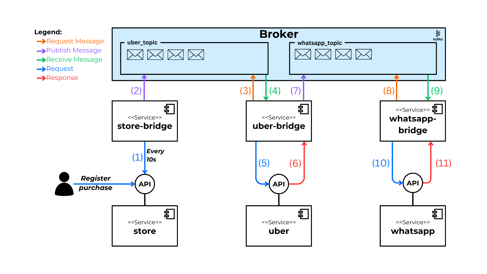

# Alternative: Kafka

En este directorio se encuentran los servicios de puente que permiten consumir las APIs de los servicios, así como la publicación y el consumo de mensajes en el broker de Kafka.

## Sobre Kafka

[Apache Kafka](https://kafka.apache.org/) is an open-source distributed event streaming platform used by thousands of companies for high-performance data pipelines, streaming analytics, data integration, and mission-critical applications.

## Ejecución

1. Asegúrate de tener Docker instalado en tu sistema.

2. Navega hasta el directorio de la implementación que deseas ejecutar (Kafka, RabbitMQ o Pulsar).

3. Ejecuta el siguiente comando para levantar los servicios:

   ```bash
   docker-compose up --build
   ```

4. Para detener los servicios, usa:

   ```bash
   docker-compose down
   ```

## Diagrama


