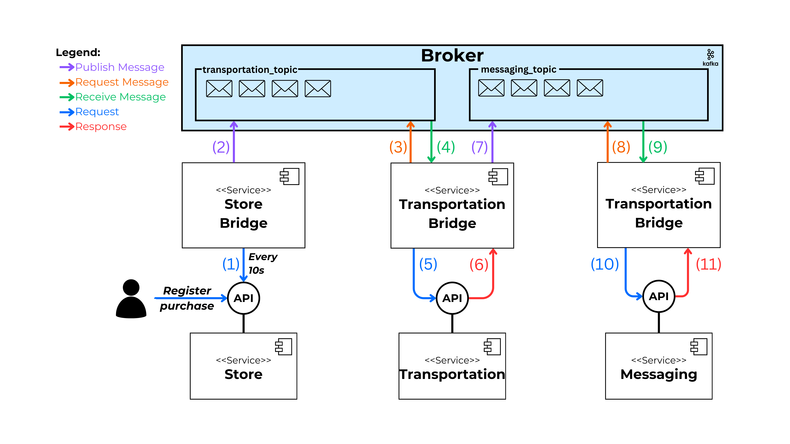

# Alternative: Kafka

This directory contains the implementation of the scenario using **Kafka**. Each of the intermediary services has been implemented to consume the APIs of **Store**, **Transportation**, and **Messaging**, while also handling the publishing and consumption of messages in the Kafka broker.

## 0. Index

1. [About Kafka](#1-about-kafka)
2. [Implementation Diagram](#2-implementation-diagram)
3. [Execution](#3-execution)

## 1. About Kafka

[Apache Kafka](https://kafka.apache.org/) is a distributed, open-source event streaming platform used by thousands of companies worldwide.

## 2. Implementation Diagram

The following diagram represents the flow of the composite process executed to fulfill the requirements of the established scenario.



## 3. Execution

**Docker Compose** is used for execution. Docker Compose allows you to quickly and easily start up all services in the scenario. This includes the execution of all APIs, the intermediary services for **Store**, **Transportation**, and **Messaging**, as well as the Kafka broker.

1. Ensure that **Docker** is installed.

2. Clone the repository and navigate to the `alternatives/kafka` directory:

   ```bash
   git clone https://github.com/MarcoZulianiE/Tesis.git
   cd alternatives/kafka
   ```

3. Run the following command to start the services:

   ```bash
   docker-compose up --build
   ```

4. To stop the services, use:
   ```bash
   docker-compose down
   ```
