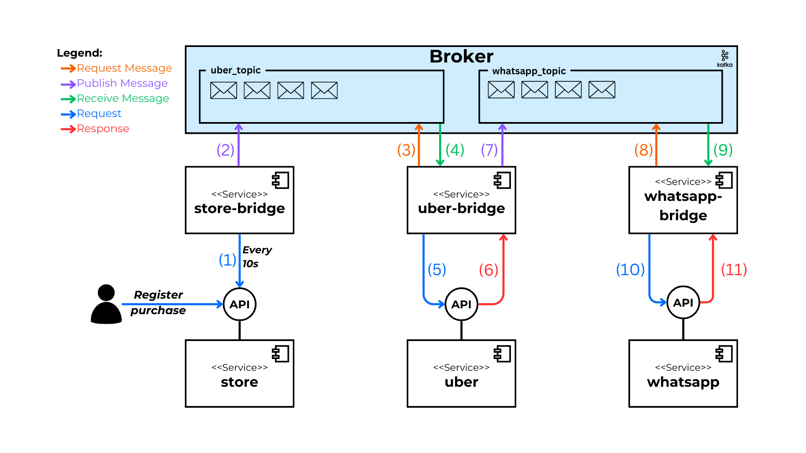

# Alternative: Pulsar

This directory contains the implementation of the scenario using **Apache Pulsar**. The bridge services have been implemented to consume the APIs of the services, as well as to handle the publishing and consumption of messages in the Pulsar broker.

## 0. Index

1. [About Pulsar](#1-about-pulsar)
2. [Implementation Diagram](#2-implementation-diagram)
3. [Execution](#3-execution)

## 1. About Pulsar

[Apache Pulsar](https://pulsar.apache.org/) is a distributed messaging and event streaming platform known for its high availability and scalability. It is recognized for its multi-tenant architecture and its ability to handle large volumes of real-time data.

## 2. Implementation Diagram

The following diagram represents the flow of the composite process executed to fulfill the requirements of the established scenario.



## 3. Execution

**Docker Compose** is used for execution. Docker Compose allows you to quickly and easily start up all the services in the scenario. This includes the execution of all APIs, the intermediary services for **Store**, **Uber**, and **WhatsApp**, as well as the Pulsar broker.

1. Ensure that **Docker** is installed.

2. Clone the repository and navigate to the `alternatives\pulsar` directory:

   ```bash
   git clone https://github.com/MarcoZulianiE/Tesis.git
   cd alternatives\pulsar
   ```

3. Run the following command to start the services:

   ```bash
   docker-compose up --build
   ```

4. To stop the services, use:
   ```bash
   docker-compose down
   ```
