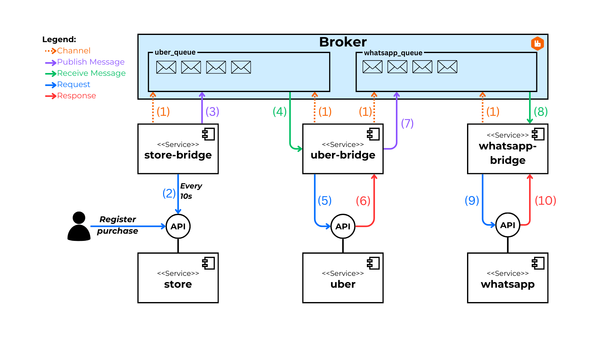

# Alternativa: RabbitMQ

En este directorio se encuentra la implementación del escenario haciendo uso de la herramienta **RabbitMQ**. Se implementan los servicios de puente que permiten consumir las APIs de los servicios, así como la publicación y el consumo de mensajes en el broker de RabbitMQ.

## 0. Índice

1. [Sobre RabbitMQ](#1-sobre-rabbitmq)
2. [Diagrama de Implementación](#2-diagrama-de-implementación)
3. [Ejecución](#3-ejecución)

## 1. Sobre RabbitMQ

[RabbitMQ](https://www.rabbitmq.com/) es un broker de mensajes y streaming confiable y maduro, que es fácil de desplegar en entornos en la nube y locales. Actualmente, es utilizado por millones de usuarios en todo el mundo.

## 2. Diagrama de Implementación

El siguiente diagrama representa el flujo del proceso compuesto que se ejecuta para el cumplimiento del requerimiento del escenario establecido.



## 3. Ejecución

Para la ejecución se utiliza **Docker Compose**. Docker Compose permite levantar todos los servicios del escenario de manera rápida y sencilla. Esto incluye la ejecución de todas las APIs y los servicios intermediarios de **Store**, **Uber** y **WhatsApp**, así como el broker de RabbitMQ.

1. Asegúrate de tener **Docker** instalado.

2. Clona el repositorio y navega al directorio de la alternativa `alternatives\rabbit-mq`:

   ```bash
   git clone https://github.com/MarcoZulianiE/Tesis.git
   cd alternatives\rabbit-mq
   ```

3. Ejecuta el siguiente comando para levantar los servicios:

   ```bash
   docker-compose up --build
   ```

4. Para detener los servicios, usa:
   ```bash
   docker-compose down
   ```
