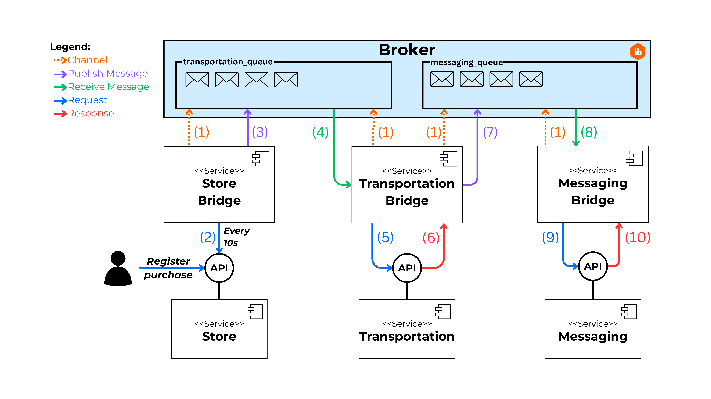

# Alternative: RabbitMQ

This directory contains the implementation of the scenario using **RabbitMQ**. The bridge services have been implemented to consume the APIs of the services, as well as to handle the publishing and consumption of messages in the RabbitMQ broker.

## 0. Index

1. [About RabbitMQ](#1-about-rabbitmq)
2. [Implementation Diagram](#2-implementation-diagram)
3. [Execution](#3-execution)

## 1. About RabbitMQ

[RabbitMQ](https://www.rabbitmq.com/) is a reliable and mature message broker and streaming platform, known for its ease of deployment in both cloud and on-premise environments. It is currently used by millions of users worldwide.

## 2. Implementation Diagram

The following diagram represents the flow of the composite process executed to fulfill the requirements of the established scenario.



## 3. Execution

**Docker Compose** is used for execution. Docker Compose allows you to quickly and easily start all the services in the scenario. This includes the execution of all APIs, the intermediary services for **Store**, **Transportation**, and **Messaging**, as well as the RabbitMQ broker.

1. Ensure that **Docker** is installed.

2. Clone the repository and navigate to the `alternatives\rabbit-mq` directory:

   ```bash
   git clone https://github.com/MarcoZulianiE/Tesis.git
   cd alternatives\rabbit-mq
   ```

3. Run the following command to start the services:

   ```bash
   docker-compose up --build
   ```

4. To stop the services, use:
   ```bash
   docker-compose down
   ```
